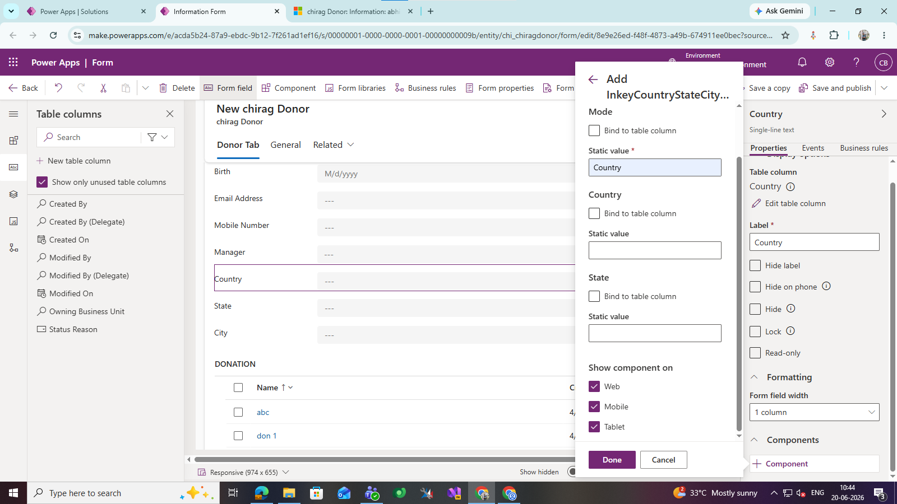
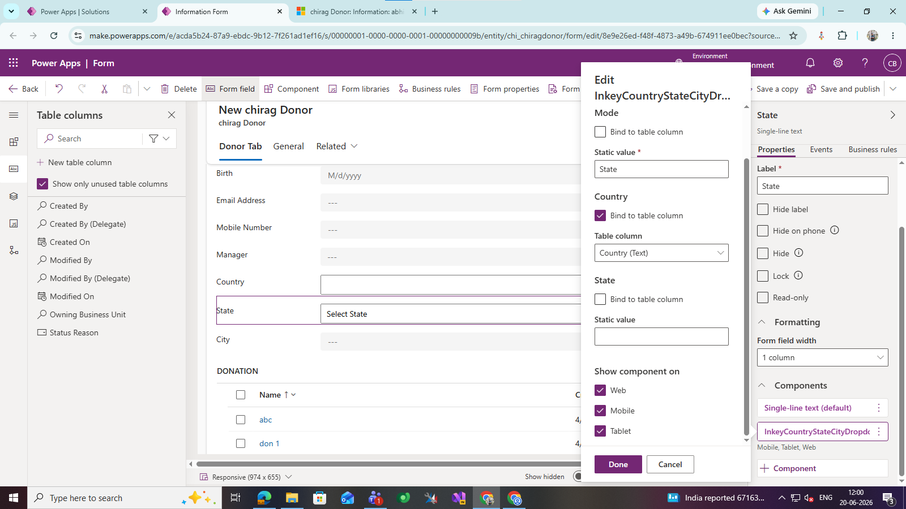
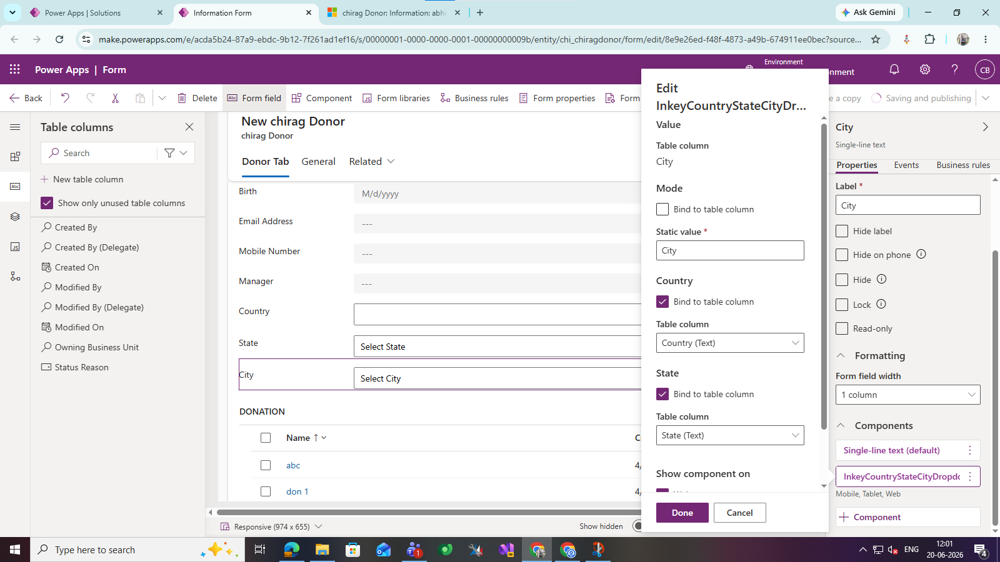

# Country State City Dropdown PCF Control
 
A Power Apps Component Framework (PCF) control that provides cascading Country, State, and City dropdowns using a single reusable component.
 
## Features
 
- Single PCF component for Country, State, and City
- Cascading dropdown functionality
- Automatic filtering of State and City
- Easy configuration
- Works with Single Line of Text columns
- Supports Model-driven Apps
 
---
 
## Prerequisites
 
Before using the control, create the following **Single Line of Text** columns in your Dataverse table:
 
| Column |
|---------|
| Country |
| State |
| City |
 
---
 
## Configuration
 
The same PCF control must be added to all three fields.
 
### 1. Country Field
 
Add the PCF control to the **Country** column.
 
Configuration:
 
| Property | Value |
|----------|-------|
| Mode | `Country` (Static Value) |
| Country | Leave Empty |
| State | Leave Empty |
 

---
 
### 2. State Field
 
Add the same PCF control to the **State** column.
 
Configuration:
 
| Property | Value |
|----------|-------|
| Mode | `State` (Static Value) |
| Country | Bind to **Country** column |
| State | Leave Empty |
 

---
 
### 3. City Field
 
Add the same PCF control to the **City** column.
 
Configuration:
 
| Property | Value |
|----------|-------|
| Mode | `City` (Static Value) |
| Country | Bind to **Country** column |
| State | Bind to **State** column |
 
 

---
 
## Usage
 
1. Add the PCF control to the **Country**, **State**, and **City** fields.
2. Configure each field as described above.
3. Save and publish the form.
4. Open the form.
5. Select a Country.
6. The State dropdown will automatically display the related states.
7. Select a State.
8. The City dropdown will automatically display the related cities.
 
---
 
## Notes
 
- The control must be configured on all three fields.
- The **Mode** property determines the behavior of the control.
- Country and State bindings are required only for dependent fields.
- All fields should be **Single Line of Text** columns.
 
---
 
## Technologies
 
- Power Apps Component Framework (PCF)
- TypeScript
- Microsoft Dataverse
- Power Apps CLI
